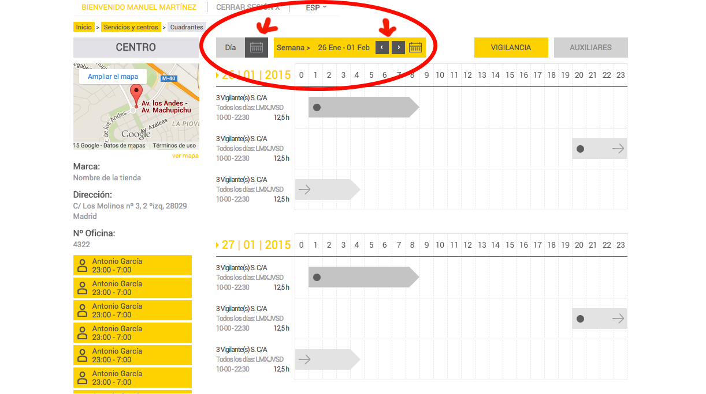

# Javascript week of the year calculator
This javascript snippet is very useful when you need a to calculate and state the week of the year depending either on a day clicked on a datepicker or on, let us say, a pagination. See the image:

### Implements:
[jQuery](https://jquery.com/)

[jQuery UI Datepicker](https://jqueryui.com/datepicker/)